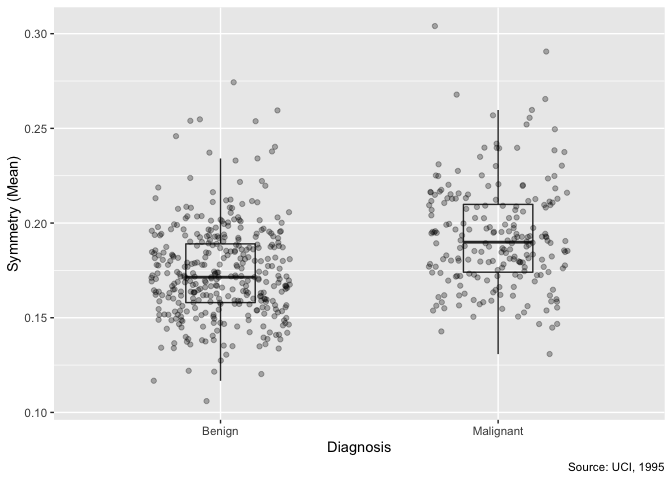

Mini Data Analysis (Milestone 1)
================
Marshall Chester
09/10/2021

-   [**Introduction**](#introduction)
-   [**Milestone 1**](#milestone-1)
    -   [**Task 1: Choose dataset**](#task-1-choose-dataset)
    -   [**Task 2: Explore dataset**](#task-2-explore-dataset)
    -   [**Task 3: Research Questions**](#task-3-research-questions)
-   [**Milestone 2**](#milestone-2)
    -   [**Task 1**](#task-1)
    -   [**Task 2**](#task-2)

# **Introduction**

### **Purpose**

The purpose of this markdown is to complete STAT 545A Mini-Data Analysis
(Milestone 1).

The author will:

1.  Become familiar with one dataset
2.  Create four questions from selected dataset
3.  Write a reproducible and clear report with R Markdown

Several open-sourced datasets will be explored, and one final dataset
will be visualized for research purposes.

### **Author**

The author of this code is Marshall Chester, with open sourced data from
the `datateachr` library.

### **Packages**

The following packages must be installed:

``` r
# install.packages("devtools")
# devtools::install_github("UBC-MDS/datateachr")
```

The following libraries must be loaded:

``` r
library(datateachr)
library(tidyverse)
```

# **Milestone 1**

## **Task 1: Choose dataset**

### **Initial ranking**

1.  `flow_sample`
2.  `cancer_sample`
3.  `vancouver_trees`
4.  `apt_buildings`

### **Dataset exploration**

``` r
dim(flow_sample)
```

    ## [1] 218   7

``` r
class(flow_sample)
```

    ## [1] "tbl_df"     "tbl"        "data.frame"

``` r
dim(cancer_sample)
```

    ## [1] 569  32

``` r
class(cancer_sample)
```

    ## [1] "spec_tbl_df" "tbl_df"      "tbl"         "data.frame"

``` r
dim(vancouver_trees)
```

    ## [1] 146611     20

``` r
class(vancouver_trees)
```

    ## [1] "tbl_df"     "tbl"        "data.frame"

``` r
dim(apt_buildings)
```

    ## [1] 3455   37

``` r
class(apt_buildings)
```

    ## [1] "tbl_df"     "tbl"        "data.frame"

### **Dataset attributes**

|      Dataset      |  Rows   | Columns |   Class    | Potential Research Question                                            |
|:-----------------:|:-------:|:-------:|:----------:|:-----------------------------------------------------------------------|
|   `flow_sample`   |   218   |    7    | data.frame | Is maximum flow always within June and July?                           |
|  `cancer_sample`  |   569   |   32    | data.frame | What is the average area of malignant diagnoses?                       |
| `vancouver_trees` | 146,611 |   20    | data.frame | Which Vancouver neighbourhood has the greatest number of tree species? |
|  `apt_buildings`  |  3,455  |   37    | data.frame | What percentage of buildings built before 2000 have air conditioning?  |

### **Pair down**

After viewing the data, I decided to proceed with cancer_sample and
apt_buildings. These datasets are rich and include greater than 30
variables and 500 points for exploration and visualization.

### **Final decision**

I have decided to proceed with the `cancer_sample` dataset due to
personal interest in healthcare. The dataset is robust with a
significant number of variables and points for further evaluation. With
subsetting, I believe this dataset is well suited for analysis of
strength of association and predictive modeling.

## **Task 2: Explore dataset**

In the `cancer_sample` dataset, `area_mean` and `radius_mean` are
continuous variables and can be explored by plotting each variable on
the x and y axis, respectively. A positive, linear relationship is
expected. By grouping data points with `diagnosis` (dichotomous
variable), an interesting relationship could be seen.

### **New tibble**

The \``cancer_sample` includes 32 unique variables. A new tibble can be
created to include the variables most interesting to the author. For the
purpose of model building, this parsed tibble will help to create an
efficient workflow.

``` r
tibble(cancer_sample) %>% #make new tibble of interested variables
  select(diagnosis, radius_mean, perimeter_mean, area_mean, smoothness_mean, symmetry_mean)
```

    ## # A tibble: 569 × 6
    ##    diagnosis radius_mean perimeter_mean area_mean smoothness_mean symmetry_mean
    ##    <chr>           <dbl>          <dbl>     <dbl>           <dbl>         <dbl>
    ##  1 M                18.0          123.      1001           0.118          0.242
    ##  2 M                20.6          133.      1326           0.0847         0.181
    ##  3 M                19.7          130       1203           0.110          0.207
    ##  4 M                11.4           77.6      386.          0.142          0.260
    ##  5 M                20.3          135.      1297           0.100          0.181
    ##  6 M                12.4           82.6      477.          0.128          0.209
    ##  7 M                18.2          120.      1040           0.0946         0.179
    ##  8 M                13.7           90.2      578.          0.119          0.220
    ##  9 M                13             87.5      520.          0.127          0.235
    ## 10 M                12.5           84.0      476.          0.119          0.203
    ## # … with 559 more rows

### **Density plot**

Peaks within a density help to understand where the data are
concentrated. In the `cancer_sample` dataset, the `area_mean` variable
provides continuous data on the average area of diagnoses. A density
plot can be created to visualize the concentration of values for both
malignant and benign diagnoses. With this visualization, a greater
understanding is available.

``` r
ggplot(cancer_sample, #check density plot of area_mean
       aes(area_mean, fill = diagnosis)) +
  geom_density(alpha = 0.6) +
  labs(x = "Area (Mean)", #add labels
       y = "Density",
       fill = "Diagnosis",
       caption = "Source: UCI, 1995") +
  scale_fill_discrete( #change legend titles
    limits = c("B", "M"),
                      labels = c("Benign", "Malignant"))
```


### **Create boxplot**

A boxplot can provide detailed information between dichotomous and
continuous variables. In the `cancer_sample` dataset, diagnosis is
dichotomous (malignant or benign) and `symmetry_mean` is continuous. A
boxplot will help visualize the relationship between malignant and
benign diagnoses. There may be an interesting outcome for further
consideration.

``` r
ggplot(cancer_sample, #create boxplot between 2 variables
       aes(x = diagnosis,
           y = symmetry_mean)) +
  geom_boxplot(alpha = 0, #add transparency and change width
               width = 0.25) +
  geom_jitter(alpha = 0.3, #add transparency and change width
              width =0.25) + 
  labs(x = "Diagnosis", #add labels
       y = "Symmetry (Mean)", 
       caption = "Source: UCI, 1995") +
  scale_x_discrete(breaks = c("B","M"), #change x tick
                   labels = c("Benign", "Malignant"))
```



### **Explore relationship**

``` r
ggplot(cancer_sample, #explore relationship between variables
       aes(x = area_mean,
           y = radius_mean, 
           group = diagnosis)) +
  geom_point(aes(color = diagnosis),
             size = 3, #add transparency and change size
             alpha = 0.4) +
    labs(x = "Area (Mean)", #add labels
         y = "Radius (Mean)", 
         caption = "Source: UCI, 1995") +
    scale_color_discrete(name = "Diagnosis", #change legend
                         labels=c("Benign", "Malignant")) +
    facet_wrap(~diagnosis) + #facet
  theme(strip.text.x = element_blank())
```


## **Task 3: Research Questions**

With the dataset selected and explored, four potential research
questions are postulated.

1.  Is area_mean a significant predictor of a malignant `diagnosis`?

2.  Which category of `symmetry_mean` (low, medium, high) has the
    highest mean area_mean when grouped by diagnosis?

3.  Are `perimeter_mean`, `smoothness_mean`, and `symmetry_mean`
    normally distributed?

4.  Is `perimeter_mean` lognormally distributed?

# **Milestone 2**

Addressing each research question through manipulating and summarizing
the `cancer_sample` data frame.

## **Task 1**

### **Question 1**: Is `area_mean` a significant predictor of a malignant diagnosis?

To begin, summarized characteristics of `area_mean` will be tabled.

``` r
tibble(cancer_sample) %>% #make new tibble to find range by category
  select(diagnosis, area_mean) %>% #filter by malignant diagnoses
  group_by(diagnosis) %>%
  summarise(across(where(is.numeric), range)) # find range
```

    ## `summarise()` has grouped output by 'diagnosis'. You can override using the `.groups` argument.

    ## # A tibble: 4 × 2
    ## # Groups:   diagnosis [2]
    ##   diagnosis area_mean
    ##   <chr>         <dbl>
    ## 1 B              144.
    ## 2 B              992.
    ## 3 M              362.
    ## 4 M             2501

``` r
tibble(cancer_sample) %>% #make new tibble to find mean by category
  select(diagnosis, area_mean) %>% #filter by malignant diagnoses
  group_by(diagnosis) %>%
  summarise(across(where(is.numeric), mean)) # find mean
```

    ## # A tibble: 2 × 2
    ##   diagnosis area_mean
    ##   <chr>         <dbl>
    ## 1 B              463.
    ## 2 M              978.

``` r
tibble(cancer_sample) %>% #make new tibble to find median by category
  select(diagnosis, area_mean) %>% #filter by malignant diagnoses
  group_by(diagnosis) %>%
  summarise(across(where(is.numeric), median)) # find median
```

    ## # A tibble: 2 × 2
    ##   diagnosis area_mean
    ##   <chr>         <dbl>
    ## 1 B              458.
    ## 2 M              932

``` r
tibble(cancer_sample) %>% #make tibble for standard deviation by category
  select(diagnosis, area_mean) %>% #filter by malignant diagnoses
  group_by(diagnosis) %>%
  summarise(across(where(is.numeric), sd)) # find standard deviation
```

    ## # A tibble: 2 × 2
    ##   diagnosis area_mean
    ##   <chr>         <dbl>
    ## 1 B              134.
    ## 2 M              368.

To visualize the relationship between the means of `area_mean` and
`diagnosis`, a boxplot will be created.

``` r
ggplot(cancer_sample, #visualize relationship between area and diagnosis
       aes(x = diagnosis,
           y = area_mean)) +
  geom_boxplot(aes(),
             alpha = 0.4) + 
    geom_jitter(alpha = 0.4, #customize alpha transparency
              width =0.25) + 
  labs(x = "Diagnosis", #add labels
       y = "Area (Mean)", 
       caption = "Source: UCI, 1995") +
  scale_x_discrete(breaks = c("B","M"), #change x tick
                   labels = c("Benign", "Malignant"))
```


An ANOVA test to determine the ratio of variability within and between
grouped means of area_mean by diagnosis will be displayed. The
summarized output will be printed.

``` r
summary(aov(area_mean ~ diagnosis, data = cancer_sample)) #run ANOVA for differences of means
```

    ##              Df   Sum Sq  Mean Sq F value Pr(>F)    
    ## diagnosis     1 35358547 35358547   573.1 <2e-16 ***
    ## Residuals   567 34984592    61701                   
    ## ---
    ## Signif. codes:  0 '***' 0.001 '**' 0.01 '*' 0.05 '.' 0.1 ' ' 1

``` r
#f-value of 573.1 and p less than 2*10^-16
summary(lm(area_mean ~ diagnosis, data = cancer_sample)) #quantify relationship
```

    ## 
    ## Call:
    ## lm(formula = area_mean ~ diagnosis, data = cancer_sample)
    ## 
    ## Residuals:
    ##     Min      1Q  Median      3Q     Max 
    ## -616.78 -141.99  -12.89  113.62 1522.62 
    ## 
    ## Coefficients:
    ##             Estimate Std. Error t value Pr(>|t|)    
    ## (Intercept)   462.79      13.15   35.20   <2e-16 ***
    ## diagnosisM    515.59      21.54   23.94   <2e-16 ***
    ## ---
    ## Signif. codes:  0 '***' 0.001 '**' 0.01 '*' 0.05 '.' 0.1 ' ' 1
    ## 
    ## Residual standard error: 248.4 on 567 degrees of freedom
    ## Multiple R-squared:  0.5027, Adjusted R-squared:  0.5018 
    ## F-statistic: 573.1 on 1 and 567 DF,  p-value: < 2.2e-16

``` r
#t-value for malignant diagnosis 23.94
```

With an F-value of 573.1 and p-value less than 0.05, there is a
significant variability of group means. Furthermore, a t-value greater
than 2 (t-value = 23.94, p-value \< 0.05) we can say with 95% confidence
that the difference in means is statistically significant. Finally, a
multiple r-squared value of 0.5027 indicates that greater than 50% of
the variance in the response data is explained by the model. Therefore,
`area_mean` is a significant predictor of a malignant diagnosis.

### **Question 2**: Which category of `symmetry_mean` (low, medium, high) has the highest mean area_mean?

To visualize the means of each category, a boxplot containing a new
category of symmetry_mean will be created.

``` r
cancer_sample %>% 
  mutate(category_symmetry = cut(symmetry_mean, 
                        breaks = 3,
                      labels = c("low","medium","high"))) %>%
  ggplot(aes(x = category_symmetry,
           y = area_mean)) +
  geom_boxplot(aes(),
             alpha = 0.4) +
  geom_point(aes(colour = factor(diagnosis)),
             alpha = 0.2) +
  labs(x = "Symmetry Category", #add labels
       y = "Area (Mean)", 
       caption = "Source: UCI, 1995") +
    scale_x_discrete(breaks = c("low","medium", "high"), #change x tick
                   labels = c("Low", "Medium", "High")) + 
    scale_colour_discrete(limits = c("B", "M"),
                          labels = c("Benign", "Malignant"),
                          name = "Diagnosis")
```


Therefore, it can be concluded that the category of “high” in
`symmetry_mean` produces the highest mean `area_mean` across all
categories.

### **Question 3**: Are `perimeter_mean`, `smoothness_mean`, and `symmetry_mean` normally distributed?

To visualize the normal distribution, histograms and qq plots for each
variable will be created. Different sized bins will be allocated to each
histogram.

``` r
ggplot(cancer_sample,
       aes(perimeter_mean)) +
  geom_histogram(bins = 30) + 
    labs(x = "Perimeter (Mean)", #add labels
       y = "Count", 
       caption = "Source: UCI, 1995")
```


``` r
ggplot(cancer_sample,
       aes(sample = perimeter_mean)) +
  stat_qq() + stat_qq_line()
```


``` r
ggplot(cancer_sample,
       aes(smoothness_mean)) +
  geom_histogram(bins = 25) + 
    labs(x = "Smoothness (Mean)", #add labels
       y = "Count", 
       caption = "Source: UCI, 1995")
```


``` r
ggplot(cancer_sample,
       aes(sample = smoothness_mean)) +
  stat_qq() + stat_qq_line()
```


``` r
ggplot(cancer_sample,
       aes(symmetry_mean)) +
  geom_histogram(bins = 20) + 
    labs(x = "Symmetry (Mean)", #add labels
       y = "Count", 
       caption = "Source: UCI, 1995")
```


``` r
ggplot(cancer_sample,
       aes(sample = symmetry_mean)) +
  stat_qq() + stat_qq_line()
```


The `perimeter_mean` histogram appears to be lognormal with concentrated
values below the mean and right skew. The qq plot appears to show
non-normal deviation from the qq line. The `smoothness_mean` and
`symmetry_mean` histograms appear normal with concentrated values about
the mean and no skew. The qq plots show normal distribution.

### **Question 4**: Is `perimeter_mean` lognormally distributed?

``` r
ggplot(cancer_sample,
       aes(perimeter_mean,
           log = "y")) +
  geom_histogram(bins = 25) + 
  scale_y_continuous(trans = "log10") + 
    labs(x = "Perimeter (Mean)", #add labels
       y = "Count", 
       caption = "Source: UCI, 1995")
```


``` r
ggplot(cancer_sample,
       aes(sample = symmetry_mean),
         scale_y_continuous(trans = "log10")) +
  stat_qq() + stat_qq_line()
```


After log transformation, the `perimeter_mean` histogram appears to be
concentrated about the mean without skew. The log-transformed qq plot
now follows a distribution more indicative of a normal distribution.
Therefore, the `perimeter_mean` variable is log-normally distributed.

## **Task 2**

### **Tidy Data**

All datasets should be tidy and reshaped to ensure:

-   each row is an observation
-   each column is a variable
-   each cell is a value

To following tibble used for the analysis is in tidy format.

``` r
tibble(cancer_sample) %>% 
  select(diagnosis, radius_mean, perimeter_mean, area_mean, smoothness_mean, symmetry_mean)
```

    ## # A tibble: 569 × 6
    ##    diagnosis radius_mean perimeter_mean area_mean smoothness_mean symmetry_mean
    ##    <chr>           <dbl>          <dbl>     <dbl>           <dbl>         <dbl>
    ##  1 M                18.0          123.      1001           0.118          0.242
    ##  2 M                20.6          133.      1326           0.0847         0.181
    ##  3 M                19.7          130       1203           0.110          0.207
    ##  4 M                11.4           77.6      386.          0.142          0.260
    ##  5 M                20.3          135.      1297           0.100          0.181
    ##  6 M                12.4           82.6      477.          0.128          0.209
    ##  7 M                18.2          120.      1040           0.0946         0.179
    ##  8 M                13.7           90.2      578.          0.119          0.220
    ##  9 M                13             87.5      520.          0.127          0.235
    ## 10 M                12.5           84.0      476.          0.119          0.203
    ## # … with 559 more rows

In the `cancer_sample`, each row is an observation. Each column is a
unique variable of the tumour, and each cell is a value in the form of
numbers (quantitative) or strings (qualitative). In its current format,
the data meets the criteria of tidy data.

In this next example, the data will be untidied. The data will now
include a new column with multiple variables, observations, and values
within the `age_sex` column.

``` r
tibble(cancer_sample) %>% 
  select(diagnosis, radius_mean, perimeter_mean, area_mean, smoothness_mean, symmetry_mean) %>%
  mutate(age_sex = sample(c("male","female", 18:85), size = 569, rep = TRUE)) #add untidy column 
```

    ## # A tibble: 569 × 7
    ##    diagnosis radius_mean perimeter_mean area_mean smoothness_mean symmetry_mean
    ##    <chr>           <dbl>          <dbl>     <dbl>           <dbl>         <dbl>
    ##  1 M                18.0          123.      1001           0.118          0.242
    ##  2 M                20.6          133.      1326           0.0847         0.181
    ##  3 M                19.7          130       1203           0.110          0.207
    ##  4 M                11.4           77.6      386.          0.142          0.260
    ##  5 M                20.3          135.      1297           0.100          0.181
    ##  6 M                12.4           82.6      477.          0.128          0.209
    ##  7 M                18.2          120.      1040           0.0946         0.179
    ##  8 M                13.7           90.2      578.          0.119          0.220
    ##  9 M                13             87.5      520.          0.127          0.235
    ## 10 M                12.5           84.0      476.          0.119          0.203
    ## # … with 559 more rows, and 1 more variable: age_sex <chr>

The data is now tidied back to original format.

``` r
tibble(cancer_sample) %>% 
  select(diagnosis, radius_mean, perimeter_mean, area_mean, smoothness_mean, symmetry_mean) %>% 
  mutate(age_sex = sample(c("male","female", 18:85), size = 569, rep = TRUE)) %>%
  select(-age_sex) #delete column and return to original
```

    ## # A tibble: 569 × 6
    ##    diagnosis radius_mean perimeter_mean area_mean smoothness_mean symmetry_mean
    ##    <chr>           <dbl>          <dbl>     <dbl>           <dbl>         <dbl>
    ##  1 M                18.0          123.      1001           0.118          0.242
    ##  2 M                20.6          133.      1326           0.0847         0.181
    ##  3 M                19.7          130       1203           0.110          0.207
    ##  4 M                11.4           77.6      386.          0.142          0.260
    ##  5 M                20.3          135.      1297           0.100          0.181
    ##  6 M                12.4           82.6      477.          0.128          0.209
    ##  7 M                18.2          120.      1040           0.0946         0.179
    ##  8 M                13.7           90.2      578.          0.119          0.220
    ##  9 M                13             87.5      520.          0.127          0.235
    ## 10 M                12.5           84.0      476.          0.119          0.203
    ## # … with 559 more rows

### **Select final questions**

For the purpose of completing Milestone 3, questions 1 and 2 will be
selected for further analysis. For question 1, additional variables can
be added to create predictive models. For question 2, an analysis of the
significance of the difference in means can be postulated. Both of these
activities are of greatest interest to the author.

**Proposed additions to questions**:

1.  Are `area_mean` and `symmetry_mean` both significant predictors of a
    malignant diagnosis?

``` r
tibble(cancer_sample) %>%
  mutate(-radius_mean) %>% #remove column
  select(diagnosis, area_mean, symmetry_mean) %>% # select only these variables
  filter(area_mean < 2300) %>% #eliminate potential outliers
  arrange(desc(area_mean))
```

    ## # A tibble: 567 × 3
    ##    diagnosis area_mean symmetry_mean
    ##    <chr>         <dbl>         <dbl>
    ##  1 M              2250         0.18 
    ##  2 M              2010         0.196
    ##  3 M              1878         0.183
    ##  4 M              1841         0.199
    ##  5 M              1761         0.266
    ##  6 M              1747         0.180
    ##  7 M              1686         0.180
    ##  8 M              1685         0.22 
    ##  9 M              1682         0.150
    ## 10 M              1670         0.191
    ## # … with 557 more rows

2.  Is the difference of means between the categories of `symmetry_mean`
    (low, medium, high) statistically significant?

``` r
tibble(cancer_sample) %>%
   mutate(category_symmetry = cut(symmetry_mean, 
                        breaks = 3,
                      labels = c("low","medium","high"))) %>%
  select(diagnosis, symmetry_mean, category_symmetry) %>% # select only these variables
  filter(symmetry_mean < 0.3) %>% #eliminate potential outliers
  arrange(desc(symmetry_mean))
```

    ## # A tibble: 568 × 3
    ##    diagnosis symmetry_mean category_symmetry
    ##    <chr>             <dbl> <fct>            
    ##  1 M                 0.291 high             
    ##  2 B                 0.274 high             
    ##  3 M                 0.268 high             
    ##  4 M                 0.266 high             
    ##  5 M                 0.260 high             
    ##  6 B                 0.260 high             
    ##  7 M                 0.257 high             
    ##  8 M                 0.256 high             
    ##  9 B                 0.255 high             
    ## 10 B                 0.254 high             
    ## # … with 558 more rows
