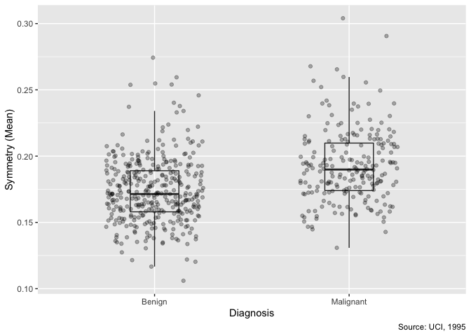
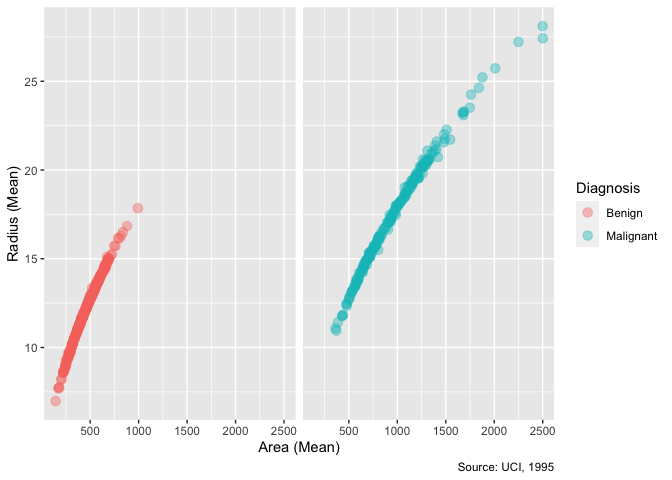

Mini Data Analysis (Milestone 1)
================
Marshall Chester
09/10/2021

-   [**Introduction**](#introduction)
-   [**Milestone 1**](#milestone-1)
    -   [**Task 1: Choose dataset**](#task-1-choose-dataset)
    -   [**Task 2: Explore dataset**](#task-2-explore-dataset)
    -   [**Task 3: Research Questions**](#task-3-research-questions)

# **Introduction**

### **Purpose**

The purpose of this markdown is to complete STAT 545A Mini-Data Analysis
(Milestone 1).

The author will:

1.  Become familiar with one dataset
2.  Create four questions from selected dataset
3.  Write a reproducible and clear report with R Markdown

Several open-sourced datasets will be explored, and one final dataset
will be visualized for research purposes.

### **Author**

The author of this code is Marshall Chester, with open sourced data from
the `datateachr` library.

### **Packages**

The following packages must be installed:

``` r
# install.packages("devtools")
# devtools::install_github("UBC-MDS/datateachr")
```

The following libraries must be loaded:

``` r
library(datateachr)
library(tidyverse)
```

# **Milestone 1**

## **Task 1: Choose dataset**

### **Initial ranking**

1.  `flow_sample`
2.  `cancer_sample`
3.  `vancouver_trees`
4.  `apt_buildings`

### **Dataset exploration**

``` r
glimpse(flow_sample)
```

    ## Rows: 218
    ## Columns: 7
    ## $ station_id   <chr> "05BB001", "05BB001", "05BB001", "05BB001", "05BB001", "0…
    ## $ year         <dbl> 1909, 1910, 1911, 1912, 1913, 1914, 1915, 1916, 1917, 191…
    ## $ extreme_type <chr> "maximum", "maximum", "maximum", "maximum", "maximum", "m…
    ## $ month        <dbl> 7, 6, 6, 8, 6, 6, 6, 6, 6, 6, 6, 7, 6, 6, 6, 7, 5, 7, 6, …
    ## $ day          <dbl> 7, 12, 14, 25, 11, 18, 27, 20, 17, 15, 22, 3, 9, 5, 14, 5…
    ## $ flow         <dbl> 314, 230, 264, 174, 232, 214, 236, 309, 174, 345, 185, 24…
    ## $ sym          <chr> NA, NA, NA, NA, NA, NA, NA, NA, NA, NA, NA, NA, NA, NA, N…

``` r
glimpse(cancer_sample)
```

    ## Rows: 569
    ## Columns: 32
    ## $ ID                      <dbl> 842302, 842517, 84300903, 84348301, 84358402, …
    ## $ diagnosis               <chr> "M", "M", "M", "M", "M", "M", "M", "M", "M", "…
    ## $ radius_mean             <dbl> 17.990, 20.570, 19.690, 11.420, 20.290, 12.450…
    ## $ texture_mean            <dbl> 10.38, 17.77, 21.25, 20.38, 14.34, 15.70, 19.9…
    ## $ perimeter_mean          <dbl> 122.80, 132.90, 130.00, 77.58, 135.10, 82.57, …
    ## $ area_mean               <dbl> 1001.0, 1326.0, 1203.0, 386.1, 1297.0, 477.1, …
    ## $ smoothness_mean         <dbl> 0.11840, 0.08474, 0.10960, 0.14250, 0.10030, 0…
    ## $ compactness_mean        <dbl> 0.27760, 0.07864, 0.15990, 0.28390, 0.13280, 0…
    ## $ concavity_mean          <dbl> 0.30010, 0.08690, 0.19740, 0.24140, 0.19800, 0…
    ## $ concave_points_mean     <dbl> 0.14710, 0.07017, 0.12790, 0.10520, 0.10430, 0…
    ## $ symmetry_mean           <dbl> 0.2419, 0.1812, 0.2069, 0.2597, 0.1809, 0.2087…
    ## $ fractal_dimension_mean  <dbl> 0.07871, 0.05667, 0.05999, 0.09744, 0.05883, 0…
    ## $ radius_se               <dbl> 1.0950, 0.5435, 0.7456, 0.4956, 0.7572, 0.3345…
    ## $ texture_se              <dbl> 0.9053, 0.7339, 0.7869, 1.1560, 0.7813, 0.8902…
    ## $ perimeter_se            <dbl> 8.589, 3.398, 4.585, 3.445, 5.438, 2.217, 3.18…
    ## $ area_se                 <dbl> 153.40, 74.08, 94.03, 27.23, 94.44, 27.19, 53.…
    ## $ smoothness_se           <dbl> 0.006399, 0.005225, 0.006150, 0.009110, 0.0114…
    ## $ compactness_se          <dbl> 0.049040, 0.013080, 0.040060, 0.074580, 0.0246…
    ## $ concavity_se            <dbl> 0.05373, 0.01860, 0.03832, 0.05661, 0.05688, 0…
    ## $ concave_points_se       <dbl> 0.015870, 0.013400, 0.020580, 0.018670, 0.0188…
    ## $ symmetry_se             <dbl> 0.03003, 0.01389, 0.02250, 0.05963, 0.01756, 0…
    ## $ fractal_dimension_se    <dbl> 0.006193, 0.003532, 0.004571, 0.009208, 0.0051…
    ## $ radius_worst            <dbl> 25.38, 24.99, 23.57, 14.91, 22.54, 15.47, 22.8…
    ## $ texture_worst           <dbl> 17.33, 23.41, 25.53, 26.50, 16.67, 23.75, 27.6…
    ## $ perimeter_worst         <dbl> 184.60, 158.80, 152.50, 98.87, 152.20, 103.40,…
    ## $ area_worst              <dbl> 2019.0, 1956.0, 1709.0, 567.7, 1575.0, 741.6, …
    ## $ smoothness_worst        <dbl> 0.1622, 0.1238, 0.1444, 0.2098, 0.1374, 0.1791…
    ## $ compactness_worst       <dbl> 0.6656, 0.1866, 0.4245, 0.8663, 0.2050, 0.5249…
    ## $ concavity_worst         <dbl> 0.71190, 0.24160, 0.45040, 0.68690, 0.40000, 0…
    ## $ concave_points_worst    <dbl> 0.26540, 0.18600, 0.24300, 0.25750, 0.16250, 0…
    ## $ symmetry_worst          <dbl> 0.4601, 0.2750, 0.3613, 0.6638, 0.2364, 0.3985…
    ## $ fractal_dimension_worst <dbl> 0.11890, 0.08902, 0.08758, 0.17300, 0.07678, 0…

``` r
glimpse(vancouver_trees)
```

    ## Rows: 146,611
    ## Columns: 20
    ## $ tree_id            <dbl> 149556, 149563, 149579, 149590, 149604, 149616, 149…
    ## $ civic_number       <dbl> 494, 450, 4994, 858, 5032, 585, 4909, 4925, 4969, 7…
    ## $ std_street         <chr> "W 58TH AV", "W 58TH AV", "WINDSOR ST", "E 39TH AV"…
    ## $ genus_name         <chr> "ULMUS", "ZELKOVA", "STYRAX", "FRAXINUS", "ACER", "…
    ## $ species_name       <chr> "AMERICANA", "SERRATA", "JAPONICA", "AMERICANA", "C…
    ## $ cultivar_name      <chr> "BRANDON", NA, NA, "AUTUMN APPLAUSE", NA, "CHANTICL…
    ## $ common_name        <chr> "BRANDON ELM", "JAPANESE ZELKOVA", "JAPANESE SNOWBE…
    ## $ assigned           <chr> "N", "N", "N", "Y", "N", "N", "N", "N", "N", "N", "…
    ## $ root_barrier       <chr> "N", "N", "N", "N", "N", "N", "N", "N", "N", "N", "…
    ## $ plant_area         <chr> "N", "N", "4", "4", "4", "B", "6", "6", "3", "3", "…
    ## $ on_street_block    <dbl> 400, 400, 4900, 800, 5000, 500, 4900, 4900, 4900, 7…
    ## $ on_street          <chr> "W 58TH AV", "W 58TH AV", "WINDSOR ST", "E 39TH AV"…
    ## $ neighbourhood_name <chr> "MARPOLE", "MARPOLE", "KENSINGTON-CEDAR COTTAGE", "…
    ## $ street_side_name   <chr> "EVEN", "EVEN", "EVEN", "EVEN", "EVEN", "ODD", "ODD…
    ## $ height_range_id    <dbl> 2, 4, 3, 4, 2, 2, 3, 3, 2, 2, 2, 5, 3, 2, 2, 2, 2, …
    ## $ diameter           <dbl> 10.00, 10.00, 4.00, 18.00, 9.00, 5.00, 15.00, 14.00…
    ## $ curb               <chr> "N", "N", "Y", "Y", "Y", "Y", "Y", "Y", "Y", "Y", "…
    ## $ date_planted       <date> 1999-01-13, 1996-05-31, 1993-11-22, 1996-04-29, 19…
    ## $ longitude          <dbl> -123.1161, -123.1147, -123.0846, -123.0870, -123.08…
    ## $ latitude           <dbl> 49.21776, 49.21776, 49.23938, 49.23469, 49.23894, 4…

``` r
glimpse(apt_buildings)
```

    ## Rows: 3,455
    ## Columns: 37
    ## $ id                               <dbl> 10359, 10360, 10361, 10362, 10363, 10…
    ## $ air_conditioning                 <chr> "NONE", "NONE", "NONE", "NONE", "NONE…
    ## $ amenities                        <chr> "Outdoor rec facilities", "Outdoor po…
    ## $ balconies                        <chr> "YES", "YES", "YES", "YES", "NO", "NO…
    ## $ barrier_free_accessibilty_entr   <chr> "YES", "NO", "NO", "YES", "NO", "NO",…
    ## $ bike_parking                     <chr> "0 indoor parking spots and 10 outdoo…
    ## $ exterior_fire_escape             <chr> "NO", "NO", "NO", "YES", "NO", NA, "N…
    ## $ fire_alarm                       <chr> "YES", "YES", "YES", "YES", "YES", "Y…
    ## $ garbage_chutes                   <chr> "YES", "YES", "NO", "NO", "NO", "NO",…
    ## $ heating_type                     <chr> "HOT WATER", "HOT WATER", "HOT WATER"…
    ## $ intercom                         <chr> "YES", "YES", "YES", "YES", "YES", "Y…
    ## $ laundry_room                     <chr> "YES", "YES", "YES", "YES", "YES", "Y…
    ## $ locker_or_storage_room           <chr> "NO", "YES", "YES", "YES", "NO", "YES…
    ## $ no_of_elevators                  <dbl> 3, 3, 0, 1, 0, 0, 0, 2, 4, 2, 0, 2, 2…
    ## $ parking_type                     <chr> "Underground Garage , Garage accessib…
    ## $ pets_allowed                     <chr> "YES", "YES", "YES", "YES", "YES", "Y…
    ## $ prop_management_company_name     <chr> NA, "SCHICKEDANZ BROS. PROPERTIES", N…
    ## $ property_type                    <chr> "PRIVATE", "PRIVATE", "PRIVATE", "PRI…
    ## $ rsn                              <dbl> 4154812, 4154815, 4155295, 4155309, 4…
    ## $ separate_gas_meters              <chr> "NO", "NO", "NO", "NO", "NO", "NO", "…
    ## $ separate_hydro_meters            <chr> "YES", "YES", "YES", "YES", "YES", "Y…
    ## $ separate_water_meters            <chr> "NO", "NO", "NO", "NO", "NO", "NO", "…
    ## $ site_address                     <chr> "65  FOREST MANOR RD", "70  CLIPPER R…
    ## $ sprinkler_system                 <chr> "YES", "YES", "NO", "YES", "NO", "NO"…
    ## $ visitor_parking                  <chr> "PAID", "FREE", "UNAVAILABLE", "UNAVA…
    ## $ ward                             <chr> "17", "17", "03", "03", "02", "02", "…
    ## $ window_type                      <chr> "DOUBLE PANE", "DOUBLE PANE", "DOUBLE…
    ## $ year_built                       <dbl> 1967, 1970, 1927, 1959, 1943, 1952, 1…
    ## $ year_registered                  <dbl> 2017, 2017, 2017, 2017, 2017, NA, 201…
    ## $ no_of_storeys                    <dbl> 17, 14, 4, 5, 4, 4, 4, 7, 32, 4, 4, 7…
    ## $ emergency_power                  <chr> "NO", "YES", "NO", "NO", "NO", "NO", …
    ## $ `non-smoking_building`           <chr> "YES", "NO", "YES", "YES", "YES", "NO…
    ## $ no_of_units                      <dbl> 218, 206, 34, 42, 25, 34, 14, 105, 57…
    ## $ no_of_accessible_parking_spaces  <dbl> 8, 10, 20, 42, 12, 0, 5, 1, 1, 6, 12,…
    ## $ facilities_available             <chr> "Recycling bins", "Green Bin / Organi…
    ## $ cooling_room                     <chr> "NO", "NO", "NO", "NO", "NO", "NO", "…
    ## $ no_barrier_free_accessible_units <dbl> 2, 0, 0, 42, 0, NA, 14, 0, 0, 1, 25, …

### **Dataset attributes**

|      Dataset      |  Rows   | Columns |   Class    | Potential Research Question                                            |
|:-----------------:|:-------:|:-------:|:----------:|:-----------------------------------------------------------------------|
|   `flow_sample`   |   218   |    7    | data.frame | Is maximum flow always within June and July?                           |
|  `cancer_sample`  |   569   |   32    | data.frame | What is the average area of malignant diagnoses?                       |
| `vancouver_trees` | 146,611 |   20    | data.frame | Which Vancouver neighbourhood has the greatest number of tree species? |
|  `apt_buildings`  |  3,455  |   37    | data.frame | What percentage of buildings built before 2000 have air conditioning?  |

### **Pair down**

After viewing the data, I decided to proceed with cancer_sample and
apt_buildings. These datasets are rich and include greater than 30
variables and 500 points for exploration and visualization.

### **Final decision**

I have decided to proceed with the `cancer_sample` dataset due to
personal interest in healthcare. The dataset is robust with a
significant number of variables and points for further evaluation. With
subsetting, I believe this dataset is well suited for analysis of
strength of association and predictive modeling.

## **Task 2: Explore dataset**

In the `cancer_sample` dataset, `area_mean` and `radius_mean` are
continuous variables and can be explored by plotting each variable on
the x and y axis, respectively. A positive, linear relationship is
expected. By grouping data points with `diagnosis` (dichotomous
variable), an interesting relationship could be seen.

### **New tibble**

The \``cancer_sample` includes 32 unique variables. A new tibble can be
created to include the variables most interesting to the author. For the
purpose of model building, this parsed tibble will help to create an
efficient workflow.

``` r
tibble(cancer_sample) %>% #make new tibble of interested variables
  select(diagnosis, radius_mean, perimeter_mean, area_mean, smoothness_mean, symmetry_mean)
```

    ## # A tibble: 569 × 6
    ##    diagnosis radius_mean perimeter_mean area_mean smoothness_mean symmetry_mean
    ##    <chr>           <dbl>          <dbl>     <dbl>           <dbl>         <dbl>
    ##  1 M                18.0          123.      1001           0.118          0.242
    ##  2 M                20.6          133.      1326           0.0847         0.181
    ##  3 M                19.7          130       1203           0.110          0.207
    ##  4 M                11.4           77.6      386.          0.142          0.260
    ##  5 M                20.3          135.      1297           0.100          0.181
    ##  6 M                12.4           82.6      477.          0.128          0.209
    ##  7 M                18.2          120.      1040           0.0946         0.179
    ##  8 M                13.7           90.2      578.          0.119          0.220
    ##  9 M                13             87.5      520.          0.127          0.235
    ## 10 M                12.5           84.0      476.          0.119          0.203
    ## # … with 559 more rows

### **Density plot**

Peaks within a density help to understand where the data are
concentrated. In the `cancer_sample` dataset, the `area_mean` variable
provides continuous data on the average area of diagnoses. A density
plot can be created to visualize the concentration of values for both
malignant and benign diagnoses. With this visualization, a greater
understanding is available.

``` r
ggplot(cancer_sample, #check density plot of area_mean
       aes(area_mean, fill = diagnosis)) +
  geom_density(alpha = 0.6) +
  labs(x = "Area (Mean)", #add labels
       y = "Density",
       fill = "Diagnosis",
       caption = "Source: UCI, 1995") +
  scale_fill_discrete( #change legend titles
    limits = c("B", "M"),
                      labels = c("Benign", "Malignant"))
```


The `area_mean` of benign diagnoses are clustered around 500, while the
`area_mean` of malignant diagnoses appears to potentially be bimodal
clustered around 750 and 1250.

### **Create boxplot**

A boxplot can provide detailed information between dichotomous and
continuous variables. In the `cancer_sample` dataset, diagnosis is
dichotomous (malignant or benign) and `symmetry_mean` is continuous. A
boxplot will help visualize the relationship between malignant and
benign diagnoses. There may be an interesting outcome for further
consideration.

``` r
ggplot(cancer_sample, #create boxplot between 2 variables
       aes(x = diagnosis,
           y = symmetry_mean)) +
  geom_boxplot(alpha = 0, #add transparency and change width
               width = 0.25) +
  geom_jitter(alpha = 0.3, #add transparency and change width
              width =0.25) + 
  labs(x = "Diagnosis", #add labels
       y = "Symmetry (Mean)", 
       caption = "Source: UCI, 1995") +
  scale_x_discrete(breaks = c("B","M"), #change x tick
                   labels = c("Benign", "Malignant"))
```



### **Explore relationship**

``` r
ggplot(cancer_sample, #explore relationship between variables
       aes(x = area_mean,
           y = radius_mean, 
           group = diagnosis)) +
  geom_point(aes(color = diagnosis),
             size = 3, #add transparency and change size
             alpha = 0.4) +
    labs(x = "Area (Mean)", #add labels
         y = "Radius (Mean)", 
         caption = "Source: UCI, 1995") +
    scale_color_discrete(name = "Diagnosis", #change legend
                         labels=c("Benign", "Malignant")) +
    facet_wrap(~diagnosis) + #facet
  theme(strip.text.x = element_blank())
```



## **Task 3: Research Questions**

With the dataset selected and explored, four potential research
questions are postulated.

1.  Is `area_mean` a significant predictor of a malignant `diagnosis`?

2.  Which category of `symmetry_mean` (low, medium, high) has the
    highest mean `area_mean` when grouped by diagnosis?

3.  Are `perimeter_mean`, `smoothness_mean`, and `symmetry_mean`
    normally distributed?

4.  Is `perimeter_mean` lognormally distributed?
